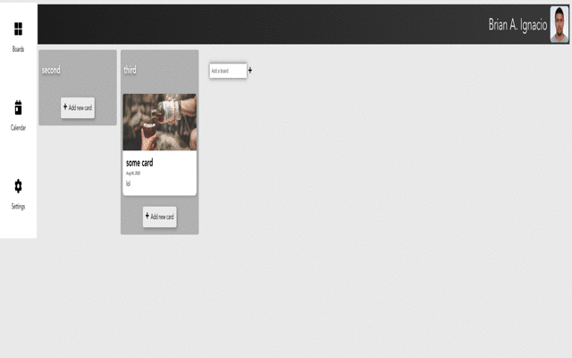

# Abilitare planning-app

<p align="center"></p>

This project is a Trello-inspired project management tool. You can make a project and create different boards which contains cards. 

A card can be considered a task since it has due date, description and title.
A board can contain many cards, and you can drag and drop a card from a board to another.

## Pages

* Teams: Allow you to add a user a given project showing you existing users in the project.
* Projects: Allows you to navigate for all your project and when you select a project, you can see all boards and cards in it.
* Calendar: Show all the cards with due date for the selected date.
* Settings: Allows you to modify user password and other user information.

## Features 

* Drag and drop functionality for cards.
* Form validation for settings page.
* Using JWT token for authorized backend request
* Cards design, edit and delete transitions.
* Implements a data service to communicate with the backend using axios. See the [planning backend project](https://github.com/brianignacio5/planning-backend).
* Handle state using vuex.

## Project setup
```
yarn install
```

### Compiles and hot-reloads for development
```
yarn serve
```

### Compiles and minifies for production
```
yarn build
```

### Run your unit tests
```
yarn test:unit
```

### Lints and fixes files
```
yarn lint
```

### Customize configuration
See [Configuration Reference](https://cli.vuejs.org/config/).
